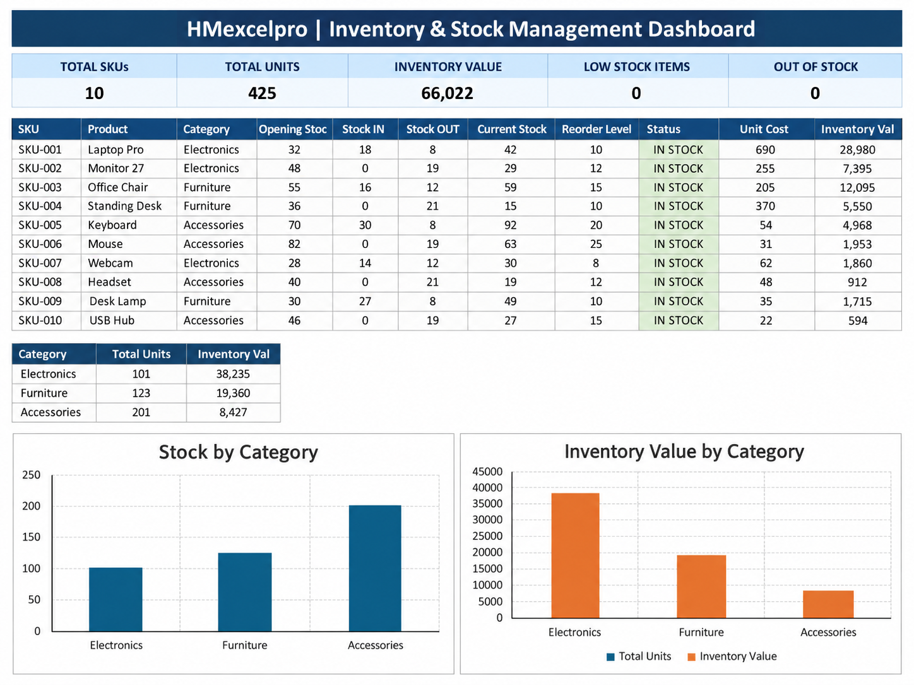

# Excel Inventory & Stock Management System

A professional Excel inventory management system designed for stock tracking, inventory control, reorder monitoring, inventory valuation, and management reporting.

This project demonstrates how Microsoft Excel can be used to organize product information, track stock movements, monitor current stock levels, identify low-stock items, and support inventory-related business decisions.

---

## 📊 Dashboard Preview

---

## 🚀 Project Overview

The system provides a structured way to manage inventory data and monitor stock performance.

It helps users track products, record stock IN and OUT movements, calculate current stock, identify low-stock items, monitor reorder levels, and review inventory value through a management dashboard.

It is designed as a practical portfolio project demonstrating Excel-based inventory analysis, stock control, and business reporting.

---

## ✨ Key Features

- Product master list
- SKU tracking
- Category tracking
- Supplier information
- Stock IN and OUT recording
- Current stock calculation
- Reorder level monitoring
- Low-stock alerts
- Out-of-stock monitoring
- Inventory valuation
- Inventory KPI reporting
- Stock movement analysis
- Management dashboard
- Data entry support

---

## 📈 Key KPIs

The dashboard provides inventory indicators including:

- Total SKUs
- Total Units in Stock
- Inventory Value
- Low Stock Items
- Out of Stock Items
- Stock Status
- Reorder Monitoring
- Product-Level Inventory Performance

---

## 📁 Workbook Structure

The Excel workbook includes sections for:

- Products
- Stock Movements
- Inventory Dashboard
- Data Entry
- Instructions

---

## 🌐 Available Languages

This project is available in two versions:

**English Version**  
`HMexcelpro_Inventory_System_EN.xlsx`

**Persian Version | نسخه فارسی**  
`HMexcelpro_Inventory_System_FA.xlsx`

A bilingual English-Persian guide is also included.

---

## 🛠️ Skills Demonstrated

- Microsoft Excel
- Inventory Management
- Stock Management
- Data Analysis
- Data Processing
- Data Visualization
- Dashboard Design
- KPI Reporting
- Management Reporting

---

## 💡 How to Use

1. Download the preferred Excel version.
2. Open the workbook in Microsoft Excel.
3. Review the product master data.
4. Review or update stock movement records.
5. Check current stock and reorder levels.
6. Open the inventory dashboard.
7. Analyze inventory KPIs, stock status, and inventory value.

> This portfolio project uses demonstration data and is intended to showcase Excel inventory management and data analysis skills.

---

## 💼 Freelance Services

I create customized Excel solutions for inventory and business reporting needs, including:

- Inventory management systems
- Stock tracking files
- Reorder monitoring
- Inventory dashboards
- KPI reporting
- Data cleaning and processing
- Data visualization
- Management reporting

---

## 👤 Author

**HMexcelpro**

Excel • Data Analysis • Data Visualization • Dashboard Design • Inventory Reporting

---

### English & Persian versions available | نسخه انگلیسی و فارسی موجود است
